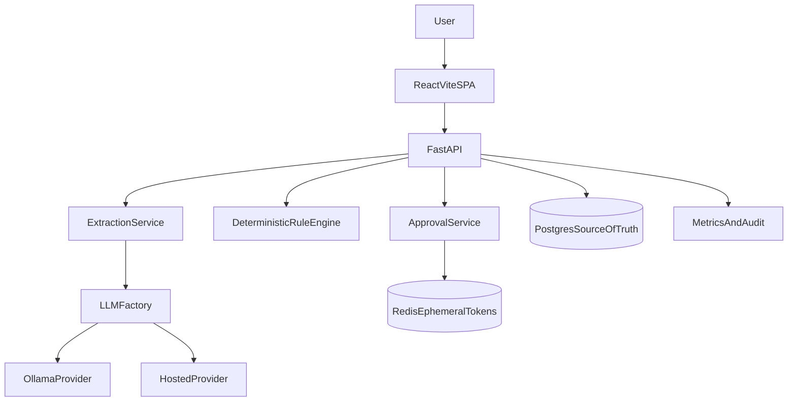

# Shift Scheduler Agent

## Problem Statement

Operations teams need to process shift-change requests quickly and consistently. Free-form natural language requests are hard to validate manually and prone to errors. This project provides a hybrid LLM + deterministic workflow that turns unstructured requests into auditable, approval-gated scheduling actions.

## Architecture



## Hybrid LLM Design

- LLM is used only for parsing free-text into a strict schema.
- Deterministic rule engine validates employee, skills, certs, and conflicts.
- All durable state lives in Postgres.
- Redis is transient only (`approval:{request_id}` with 900s TTL).
- Provider swap is env-driven via `LLM_PROVIDER=local|hosted`.

## Extraction Schema

```json
{
  "employee_first_name": "string",
  "employee_last_name": "string or null",
  "current_shift_date": "YYYY-MM-DD or null",
  "current_shift_type": "morning | night | null",
  "target_date": "YYYY-MM-DD or null",
  "target_shift_type": "morning | night | null",
  "requested_action": "swap | move | cover | null",
  "reason": "string | null"
}
```

Deterministic defaults:

- Missing `target_date` -> next occurrence.
- Ambiguous `target_shift_type` -> validation error.
- Missing `requested_action` -> `move`.

## Error Taxonomy

- `EXTRACTION_UNPARSABLE`
- `EXTRACTION_INVALID_SCHEMA`
- `RULE_EMPLOYEE_NOT_FOUND`
- `RULE_SKILL_MISMATCH`
- `RULE_CERT_EXPIRED`
- `RULE_CONFLICT`
- `APPROVAL_NOT_PENDING`
- `DB_ERROR`
- `LLM_TIMEOUT`
- `LLM_PROVIDER_ERROR`
- `EMPLOYEE_NOT_FOUND`, `EMPLOYEE_DUPLICATE_NAME`

Error payload format:

```json
{
  "errorCode": "RULE_CONFLICT",
  "userMessage": "Selected shift is unavailable.",
  "developerMessage": "Conflict detected on date/type pair.",
  "correlationId": "uuid"
}
```

## API Endpoints

- `POST /schedule/request`
- `GET /approval/pending`
- `POST /approval/{id}/approve`
- `POST /approval/{id}/reject`
- `GET /metrics?since=ISO_DATE`
- `GET /health`, `GET /health/db`, `GET /health/cache`, `GET /health/llm`
- **Employees (CRUD):** `GET /employees`, `GET /employees/{id}`, `POST /employees`, `PATCH /employees/{id}`, `DELETE /employees/{id}`

## Metrics Definition

- `total_requests`
- `approval_rate`
- `average_processing_time` = `validated_at - submitted_at`
- `parse_time_avg` = `parsed_at - submitted_at`
- `validation_time_avg` = `validated_at - parsed_at`
- `approval_latency_avg` = `approved_at - validated_at`

## Run Locally (Makefile)

All common workflows are available via `make` from the repo root. Run `make help` to list targets.

### First run

```bash
make bootstrap && make up && make seed
```

- **`make bootstrap`** — Creates `.env` from `.env.example` if missing; installs frontend deps if needed.
- **`make up`** — Starts backend, Postgres, and Redis in the background.
- **`make seed`** — Seeds the database (employees + shifts). Idempotent; safe to re-run.

Backend API: `http://localhost:8000`. Health: `http://localhost:8000/health`.

### Ollama (host) — for natural-language parsing

The app uses Ollama on your **host machine** (not in Docker). Use this workflow so `make restart` works with NL parsing:

1. **Install Ollama** on your machine: [ollama.com](https://ollama.com) (or `curl -fsSL https://ollama.com/install.sh | sh` on Linux).
2. **Pull the model once:**  
   `ollama pull llama3:8b`  
   (Or whatever you set as `OLLAMA_MODEL` in `.env`.)
3. **Start Ollama in a separate terminal** (keep it running while you dev):  
   `ollama serve`  
   If the backend (e.g. in Docker) cannot reach Ollama, try:  
   `OLLAMA_HOST=0.0.0.0:11434 ollama serve`  
   (Needed on some WSL2/Linux setups; on macOS plain `ollama serve` often works.)
4. **Start the stack:** `make up` (or `make restart`).  
   Your `.env` should have `OLLAMA_BASE_URL=http://host.docker.internal:11434` (this is the default in `.env.example`).

**Quick reference:** run `make ollama-serve` to print these steps. After the stack is up, run `make ollama-check` to verify the backend can reach Ollama.

### Daily dev

- Start Ollama (if you need NL): `ollama serve` in one terminal (use `OLLAMA_HOST=0.0.0.0:11434 ollama serve` only if the backend can’t reach it).
- Start stack: `make up` (or `make restart` to fully cycle backend/Postgres/Redis).
- View backend logs: `make logs-backend`
- Stop stack: `make down` (Ollama keeps running on the host until you stop it.)

### Database

- **Seed (or re-seed):** `make seed`
- **Schema changed / clean state:** `make db-reset` — Stops stack, removes volumes, brings it back up, then seeds. Use after model or migration changes.

### Shells and exec

- Postgres: `make psql`
- Redis: `make redis-cli`
- Backend container shell: `make backend-sh`

### Tests

Stack must be up (`make up`) and seeded (`make seed`) before running tests.

- **All tests:** `make test`
- **Unit only:** `make test-unit`
- **Integration only:** `make test-integration`

See [docs/testing.md](docs/testing.md) for the full testing strategy, TDD workflow, and CI hooks.

### Frontend

Frontend runs locally with Vite for fast reloads:

```bash
make frontend-dev
```

Or manually: `cd frontend && npm install && npm run dev`.

### Seeding (details)

Seed data includes:

- **Normal:** John, Priya, Alex (for happy-path schedule requests and approvals).
- **Edge cases:** `ExpiredCert` (triggers `RULE_CERT_EXPIRED`), `NoAdvanced` (for `RULE_SKILL_MISMATCH` when a shift requires `advanced`). A few shifts are created (assigned and open) for conflict and skill tests.

Re-running the seed updates existing seed employees and re-creates shifts in the near-future date range.

## Switching Providers (LLM)

LLM is optional: structured (non–free-text) flows work without any LLM. For natural-language parsing you can use:

- **Host Ollama (default for dev):** Run Ollama on your host; see [Ollama (host)](#ollama-host--for-natural-language-parsing) above. `.env`: `LLM_PROVIDER=local`, `OLLAMA_BASE_URL=http://host.docker.internal:11434`.
- **Ollama in Docker (optional):** `make up-ollama` then `make ollama-pull` once. In `.env` set `OLLAMA_BASE_URL=http://ollama:11434`. Use if you prefer not to run Ollama on the host.
- **Hosted (e.g. OpenAI, production):** In `.env`: `LLM_PROVIDER=hosted`, set `OPENAI_API_KEY`; optional `OPENAI_BASE_URL`, `OPENAI_MODEL`. No local Ollama needed.

No route/service code changes are required when switching.

## Example Requests

- `Swap John from Tuesday night to Wednesday morning`
- `Move Priya to Friday morning shift`
- `Can Alex cover Monday night due to illness?`

## Business Impact

- Faster scheduling turnaround by automating extraction and validation.
- Lower risk with deterministic checks and approval gating.
- Better governance with audit logs, metrics, and correlation IDs.
- Provider portability reduces vendor lock-in and improves cost control.

