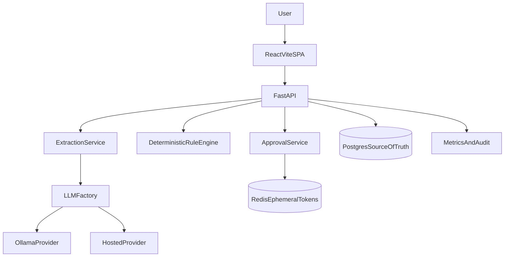

# Shift Scheduler Agent

## Problem Statement

Operations teams need to process shift-change requests quickly and consistently. Free-form natural language requests are hard to validate manually and prone to errors. This project provides a hybrid LLM + deterministic workflow that turns unstructured requests into auditable, approval-gated scheduling actions.

## Architecture



## Hybrid LLM Design

- LLM is used only for parsing free-text into a strict schema.
- Deterministic rule engine validates employee, skills, certs, and conflicts.
- All durable state lives in Postgres.
- Redis is transient only (`approval:{request_id}` with 900s TTL).
- Provider swap is env-driven via `LLM_PROVIDER=local|hosted`.

## Extraction Schema

```json
{
  "employee_first_name": "string",
  "employee_last_name": "string or null",
  "current_shift_date": "YYYY-MM-DD or null",
  "current_shift_type": "morning | night | null",
  "target_date": "YYYY-MM-DD or null",
  "target_shift_type": "morning | night | null",
  "requested_action": "swap | move | cover | null",
  "reason": "string | null"
}
```

Deterministic defaults:

- Missing `target_date` -> next occurrence.
- Ambiguous `target_shift_type` -> validation error.
- Missing `requested_action` -> `move`.

## Error Taxonomy

- `EXTRACTION_UNPARSABLE`
- `EXTRACTION_INVALID_SCHEMA`
- `RULE_EMPLOYEE_NOT_FOUND`
- `RULE_SKILL_MISMATCH`
- `RULE_CERT_EXPIRED`
- `RULE_CONFLICT`
- `APPROVAL_NOT_PENDING`
- `DB_ERROR`
- `LLM_TIMEOUT`
- `LLM_PROVIDER_ERROR`
- `EMPLOYEE_NOT_FOUND`, `EMPLOYEE_DUPLICATE_NAME`

Error payload format:

```json
{
  "errorCode": "RULE_CONFLICT",
  "userMessage": "Selected shift is unavailable.",
  "developerMessage": "Conflict detected on date/type pair.",
  "correlationId": "uuid"
}
```

## API Endpoints

- `POST /schedule/request`
- `GET /approval/pending`
- `POST /approval/{id}/approve`
- `POST /approval/{id}/reject`
- `GET /metrics?since=ISO_DATE`
- `GET /health`, `GET /health/db`, `GET /health/cache`, `GET /health/llm`
- **Employees (CRUD):** `GET /employees`, `GET /employees/{id}`, `POST /employees`, `PATCH /employees/{id}`, `DELETE /employees/{id}`

## Metrics Definition

- `total_requests`
- `approval_rate`
- `average_processing_time` = `validated_at - submitted_at`
- `parse_time_avg` = `parsed_at - submitted_at`
- `validation_time_avg` = `validated_at - parsed_at`
- `approval_latency_avg` = `approved_at - validated_at`

## Run Locally

1. Copy `.env.example` to `.env` and update values.
2. Start services:
   - `docker compose up --build`
3. Backend API: `http://localhost:8000`
4. Health check: `http://localhost:8000/health`

### Seeding the database

From the project root (with Postgres reachable and `DATABASE_URL` set, e.g. in `.env` or when running in the backend container):

```bash
python -m backend.scripts.seed_db
```

Or inside the backend container:

```bash
docker compose exec backend python -m backend.scripts.seed_db
```

Seed data includes:

- **Normal:** John, Priya, Alex (for happy-path schedule requests and approvals).
- **Edge cases:** `ExpiredCert` (triggers `RULE_CERT_EXPIRED`), `NoAdvanced` (for `RULE_SKILL_MISMATCH` when a shift requires `advanced`). A few shifts are created (assigned and open) for conflict and skill tests.

Re-running the script updates existing seed employees and re-creates shifts in the near-future date range.

Frontend:

1. `cd frontend`
2. `npm install`
3. `npm run dev`

## Switching Providers

- Local Ollama:
  - `LLM_PROVIDER=local`
  - `OLLAMA_BASE_URL=http://host.docker.internal:11434`
- Hosted:
  - `LLM_PROVIDER=hosted`
  - set `OPENAI_API_KEY`
  - optional `OPENAI_BASE_URL`, `OPENAI_MODEL`

No route/service code changes are required.

## Example Requests

- `Swap John from Tuesday night to Wednesday morning`
- `Move Priya to Friday morning shift`
- `Can Alex cover Monday night due to illness?`

## Business Impact

- Faster scheduling turnaround by automating extraction and validation.
- Lower risk with deterministic checks and approval gating.
- Better governance with audit logs, metrics, and correlation IDs.
- Provider portability reduces vendor lock-in and improves cost control.

